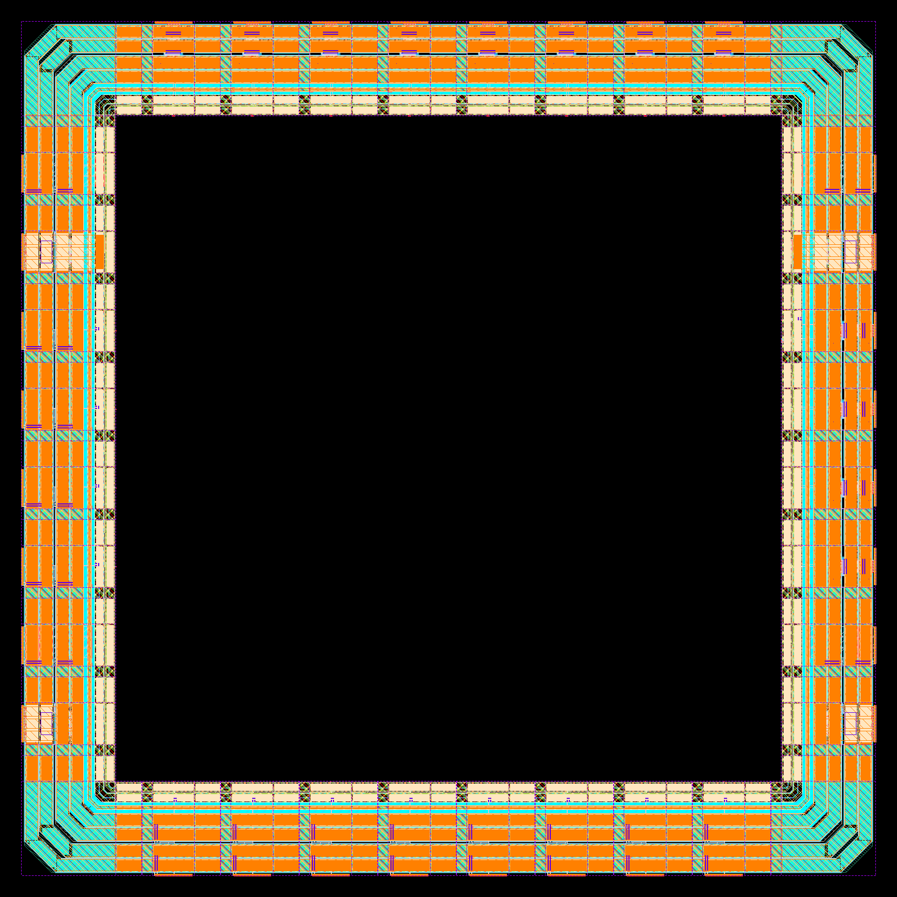
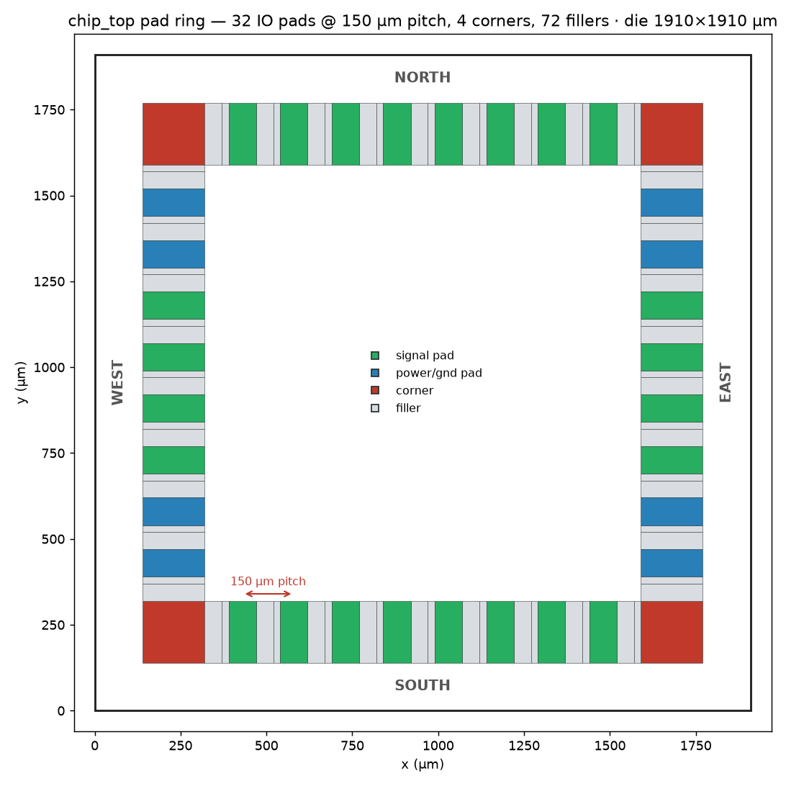

# pad-ring-ihp

Pad-ring generation for the **IHP SG13G2** 130 nm open-source process using
**[LibreLane](https://github.com/librelane/librelane)** — fully integrated, no manual GDS
assembly. The ring is described *structurally in Verilog* (one `sg13g2_IOPad*` instance
per chip pin), and LibreLane's `Chip` flow places pads, corners and fillers and closes the
ring rails by abutment via the `OpenROAD.PadRing` step.

The worked example (`chip_top`) is a 32-pad ring at a **uniform 150 µm pad pitch** on
a 1910 × 1910 µm die, around a small placeholder core:

<p align="center">
 
</p>

Left: GDS render with the IHP KLayout layer palette (closed ring — corners, pads, fillers,
continuous rails). Right: the same placement coloured by pad function.

A full write-up of the method — with the driver script, the Verilog pad idioms and the
`config.yaml` pad configuration discussed line by line — is in
[`doc/report.pdf`](doc/report.pdf).

## Quick start

Requirements: [LibreLane](https://github.com/librelane/librelane) 3.1+ with its tool set
(Yosys, OpenROAD, KLayout) and the
[IHP SG13G2 open PDK](https://github.com/IHP-GmbH/IHP-Open-PDK) at `$PDK_ROOT`.
`env.sh` exports `PDK_ROOT`/`PDK` (overridable) and adds common EDA tool locations to
`PATH` when they exist.

```sh
. ./env.sh                # export PDK_ROOT / PDK for this shell
./gen_padring.sh         # Chip flow up to OpenROAD.PadRing (pad-ring only)

# verify pitch + ring closure from the emitted DEF
python3 scripts/check_padring.py runs/RUN_*/16-openroad-padring/chip_top.def --pitch 150

# render the layout to PNG (headless KLayout, PDK layer colours)
python3 scripts/render_padring.py runs/RUN_*/16-openroad-padring/chip_top.def padring.png
```

Drop the `--to OpenROAD.PadRing` flag inside `gen_padring.sh` (or pass your own `--to`)
to run the complete chip flow: core place-and-route, seal ring, filler, density/antenna
checks, final GDS.

## How the method works

1. **Verilog defines the ring** — `src/chip_top.v` instantiates one IHP I/O cell per
   pin (`sg13g2_IOPadIn`, `...Out30mA`, `...InOut30mA`, supply pads with `(* keep *)`).
   The *instance names* are the placement handles.
2. **`config.yaml` assigns sides** — `PAD_SOUTH/EAST/NORTH/WEST` list those instance names
   in placement order; `meta.flow: Chip` selects the chip-assembly flow.
3. **The die size sets the pitch** — pads are distributed evenly, so for a target pitch
   `p` with pad width 80 µm and N pads/side:

   ```
   gap  = p − 80
   side = 2·140 (edge) + 2·180 (corners) + N·80 + (N+1)·gap
   ```

   For p = 150 µm, N = 8: side = 280 + 360 + 640 + 9·70 = **1910 µm**, exact on the 1 µm
   site grid (no flooring loss → pitch is exactly 150.0 µm, verified by
   `scripts/check_padring.py`).

Two IHP-specific points: the `sg13g2_IOPad*` cells have their wire-bond opening
*integrated* (no separate bond-pad cell exists in the PDK — hence
`PAD_BONDPAD_NAME: null`), and the PDK ships first-class LibreLane pad configuration
(`libs.tech/librelane/sg13g2_io/config.tcl`), so pad LEF/GDS, sites, corner/filler cells
and the 140 µm seal-ring inset are inherited automatically.

## Repository layout

| Path | Purpose |
|---|---|
| `src/chip_top.v` | Chip top: instantiates the pad ring (the method's core) |
| `src/demo_core.v` | Placeholder core — replace with your design |
| `config.yaml` | LibreLane config: `Chip` flow, `PAD_*` side lists, `DIE_AREA` |
| `constraint.sdc` | Clock defined at the clock pad's `p2c` pin |
| `gen_padring.sh` | Driver: runs the flow up to `OpenROAD.PadRing` |
| `scripts/check_padring.py` | Verifies uniform pitch + gap-free ring closure from the DEF |
| `scripts/render_padring.py` | DEF + IO-GDS → layout PNG (headless KLayout, PDK palette) |
| `doc/` | Report sources + built `report.pdf` (pandoc + LaTeX) |

## Adapting to your design

1. Replace `demo_core` with your core RTL (or a hardened macro via `MACROS`/`EXTRA_LEFS`).
2. Edit the pad instantiations in `chip_top.v` to your pin-out (choose drive
   strengths; add `sg13g2_IOPadAnalog` for analog pins; enough supply pads per side).
3. Update the `PAD_*` lists — instance names from `generate` loops need `\\[i\\]` escaping.
4. Re-derive `DIE_AREA` from your pad count and target pitch (formula above).
5. `./gen_padring.sh` and check the `pad_cfg.tcl` log: *"sum of cell widths … larger
   than the width of this side"* → die too small; *"No instance … found"* → name mismatch.

## Rebuilding the report

```sh
cd doc && ./build.sh      # needs pandoc + a LaTeX engine (tectonic/xelatex/lualatex)
```

The report is plain Markdown compiled to PDF **via pure LaTeX** (pandoc's default LaTeX
template; `doc/report.tex` is emitted alongside for inspection). No HTML/CSS templates.

## Third-party tools and libraries

All process-specific material comes exclusively from the **IHP SG13G2 open PDK** — no
other foundry data is used or referenced. Full details with roles in
[`doc/report.pdf`](doc/report.pdf), Appendix B.

| Tool / library | Version | License |
|---|---|---|
| IHP-Open-PDK `ihp-sg13g2` (incl. `sg13g2_io`, via Chips4Makers `c4m-pdk-ihpsg13g2`) | `144f811c` | Apache-2.0 |
| LibreLane | 3.1.0.dev1 | Apache-2.0 |
| OpenROAD | 26Q2-2270 | BSD-3-Clause |
| Yosys | 0.66 | ISC |
| KLayout (Python module) | 0.30.9 | GPL-3.0-or-later |
| Python | 3.12.3 | PSF-2.0 |
| Pandoc (docs) | 3.1.3 | GPL-2.0-or-later |
| Tectonic — LaTeX engine (docs) | 0.15.0 | MIT |
| Matplotlib (figures) | 3.11.0 | Matplotlib License |

## License

[Apache-2.0](LICENSE). The IHP SG13G2 PDK and LibreLane are likewise Apache-2.0.
